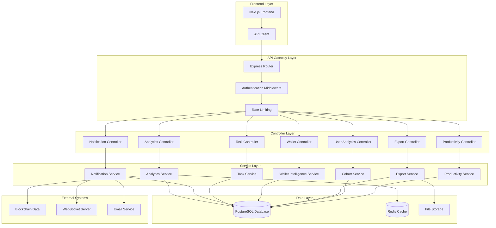

# Design Document: Missing Endpoints Implementation

## Overview

This design document outlines the implementation of 125+ missing backend endpoints for the Meta multi-chain blockchain analytics platform. The implementation will transform the platform from 17% to 100% backend completion, delivering the promised "Google Analytics for Web3" experience.

The design follows a modular architecture with clear separation of concerns across analytics processing, notification systems, task management, and data export functionality.

## Architecture

### High-Level Architecture



### Database Schema Architecture

The implementation requires several new database tables organized into functional domains:

1. **Analytics Domain**: `project_metrics`, `project_metrics_daily`, `feature_analytics`
2. **Notification Domain**: `notifications`, `alert_rules`
3. **Task Domain**: `tasks`, `task_dependencies`
4. **User Analytics Domain**: `user_cohorts`, `user_funnel_steps`
5. **Wallet Domain**: `wallet_analytics`, `wallet_comparisons`
6. **Export Domain**: `export_requests`, `export_files`

## Components and Interfaces

### 1. Analytics Engine

**Purpose**: Process blockchain data and generate real-time analytics metrics

**Key Components**:
- `MetricsCalculator`: Computes startup overview metrics
- `RetentionAnalyzer`: Calculates user retention rates
- `TransactionProcessor`: Analyzes transaction patterns
- `FeatureTracker`: Monitors feature usage statistics

**Interfaces**:
```typescript
interface AnalyticsEngine {
  calculateStartupMetrics(projectId: string): Promise<StartupMetrics>
  computeRetentionRates(projectId: string, timeframe: string): Promise<RetentionData>
  analyzeTransactionVolume(projectId: string, period: DateRange): Promise<VolumeAnalysis>
  trackFeatureUsage(projectId: string): Promise<FeatureUsageStats>
}

interface StartupMetrics {
  totalActiveWallets: number
  totalVolume: number
  totalRevenue: number
  retentionRate: number
  successRate: number
  featureUsage: FeatureUsageBreakdown
  countryStats: CountryAnalytics[]
}
```

### 2. Notification System

**Purpose**: Generate and deliver real-time alerts and notifications

**Key Components**:
- `AlertGenerator`: Creates alerts based on system events
- `NotificationDispatcher`: Delivers notifications via multiple channels
- `ThresholdMonitor`: Monitors system thresholds and triggers alerts
- `AlertProcessor`: Manages alert lifecycle and status

**Interfaces**:
```typescript
interface NotificationSystem {
  createAlert(alert: AlertRequest): Promise<Alert>
  getAlerts(filters: AlertFilters): Promise<Alert[]>
  updateAlertStatus(alertId: string, status: AlertStatus): Promise<void>
  subscribeToAlerts(projectId: string, callback: AlertCallback): void
}

interface Alert {
  id: string
  projectId: string
  type: AlertType
  severity: AlertSeverity
  title: string
  message: string
  metadata: Record<string, any>
  status: AlertStatus
  createdAt: Date
}
```

### 3. Task Management System

**Purpose**: Automate task creation and provide task lifecycle management

**Key Components**:
- `TaskGenerator`: Automatically creates tasks from alerts and system conditions
- `TaskManager`: Handles CRUD operations for tasks
- `TaskScheduler`: Manages task scheduling and due dates
- `TaskAnalyzer`: Provides task analytics and reporting

**Interfaces**:
```typescript
interface TaskManager {
  createTask(task: TaskRequest): Promise<Task>
  getTasks(filters: TaskFilters): Promise<Task[]>
  updateTask(taskId: string, updates: TaskUpdates): Promise<Task>
  deleteTask(taskId: string): Promise<void>
  searchTasks(query: string, filters: SearchFilters): Promise<Task[]>
}

interface Task {
  id: string
  projectId: string
  title: string
  description: string
  status: TaskStatus
  priority: TaskPriority
  dueDate: Date
  impact: string
  verificationCriteria: string
  autoGenerated: boolean
}
```

### 4. Wallet Intelligence System

**Purpose**: Provide advanced wallet analytics and insights

**Key Components**:
- `WalletAnalyzer`: Analyzes individual wallet behavior
- `WalletComparator`: Enables wallet-to-wallet comparisons
- `BridgeTracker`: Monitors cross-chain bridge activities
- `WalletClassifier`: Categorizes wallets by behavior patterns

**Interfaces**:
```typescript
interface WalletIntelligence {
  analyzeWallet(walletAddress: string, projectId: string): Promise<WalletAnalysis>
  compareWallets(walletIds: string[]): Promise<WalletComparison>
  getBridgeAnalytics(projectId: string): Promise<BridgeAnalytics>
  getWalletInsights(projectId: string): Promise<WalletInsights>
}

interface WalletAnalysis {
  address: string
  totalTransactions: number
  totalVolume: number
  averageTransactionValue: number
  activityPattern: ActivityPattern
  riskScore: number
  classification: WalletType
}
```

### 5. Export Service

**Purpose**: Generate and manage data exports in multiple formats

**Key Components**:
- `ExportProcessor`: Handles export request processing
- `FormatConverter`: Converts data to CSV, PDF, JSON formats
- `FileManager`: Manages export file storage and access
- `ExportScheduler`: Handles scheduled and batch exports

**Interfaces**:
```typescript
interface ExportService {
  requestExport(request: ExportRequest): Promise<ExportJob>
  getExportStatus(jobId: string): Promise<ExportStatus>
  downloadExport(jobId: string): Promise<ExportFile>
  listExports(userId: string): Promise<ExportJob[]>
}

interface ExportRequest {
  userId: string
  projectId?: string
  dataType: ExportDataType
  format: ExportFormat
  dateRange: DateRange
  filters?: Record<string, any>
}
```

## Data Models

### Core Analytics Models

```typescript
// Project Metrics Model
interface ProjectMetrics {
  id: string
  projectId: string
  totalActiveWallets: number
  totalVolume: number
  totalRevenue: number
  retentionRate: number
  totalTransactions: number
  successfulTransactions: number
  failedTransactions: number
  averageGasFee: number
  healthScore: number
  productivityScore: number
  calculatedAt: Date
  retentionData: RetentionDataPoint[]
  funnelData: FunnelStep[]
  competitorData: CompetitorMetrics
  bridgeMetrics: BridgeMetrics
  activityMetrics: ActivityMetrics
}

// Daily Metrics Model
interface ProjectMetricsDaily {
  id: string
  projectId: string
  date: Date
  activeWallets: number
  transactionVolume: number
  transactionCount: number
  revenue: number
  newUsers: number
  returningUsers: number
  featureUsage: Record<string, number>
}

// User Cohort Model
interface UserCohort {
  id: string
  projectId: string
  name: string
  description: string
  cohortType: CohortType
  totalUsers: number
  retentionRate: number
  revenuePerUser: number
  platform: Platform
  riskLevel: RiskLevel
}
```

### Notification Models

```typescript
// Notification Model
interface Notification {
  id: string
  projectId: string
  userId: string
  type: NotificationType
  title: string
  message: string
  severity: AlertSeverity
  category: string
  status: NotificationStatus
  metadata: Record<string, any>
  createdAt: Date
  readAt?: Date
  resolvedAt?: Date
}

// Task Model
interface Task {
  id: string
  projectId: string
  userId: string
  title: string
  description: string
  status: TaskStatus
  priority: TaskPriority
  dueDate?: Date
  completedAt?: Date
  impact: string
  verificationCriteria: string
  autoGenerated: boolean
  sourceAlertId?: string
  metadata: Record<string, any>
}
```

## Correctness Properties

*A property is a characteristic or behavior that should hold true across all valid executions of a system-essentially, a formal statement about what the system should do. Properties serve as the bridge between human-readable specifications and machine-verifiable correctness guarantees.*

### Property 1: Analytics Data Consistency
*For any* project with transaction data, calculating startup metrics should return consistent results when called multiple times with the same data set
**Validates: Requirements 1.1, 1.2, 1.3**

### Property 2: Retention Rate Accuracy
*For any* set of user transaction patterns, the calculated retention rate should accurately reflect the percentage of users who return within the specified time period
**Validates: Requirements 1.2**

### Property 3: Transaction Categorization Completeness
*For any* collection of transactions, the sum of successful and failed transaction counts should equal the total transaction count
**Validates: Requirements 1.3, 2.1**

### Property 4: Alert Generation Consistency
*For any* system event that meets alert criteria, the notification system should generate an alert with appropriate severity level based on the event type and impact
**Validates: Requirements 3.1, 3.2**

### Property 5: Task Auto-Generation Reliability
*For any* productivity issue or alert that meets task generation criteria, the task manager should automatically create a task with correct priority and impact assessment
**Validates: Requirements 4.1**

### Property 6: Search and Filter Accuracy
*For any* search query and filter criteria, the task manager should return only tasks that match all specified criteria
**Validates: Requirements 4.2**

### Property 7: Cohort Segmentation Correctness
*For any* set of users with defined acquisition channels and behavior patterns, the cohort analyzer should correctly segment users into appropriate cohorts based on their attributes
**Validates: Requirements 5.1**

### Property 8: Retention Matrix Calculation
*For any* cohort with user activity data over multiple weeks, the retention matrix should accurately calculate week-over-week retention percentages
**Validates: Requirements 5.2**

### Property 9: Wallet Metrics Aggregation
*For any* wallet with transaction history, the wallet intelligence system should correctly aggregate transaction counts, volumes, and calculate derived metrics
**Validates: Requirements 6.1**

### Property 10: Productivity Score Calculation
*For any* set of operational pillar data, the productivity scorer should compute a score between 0-100 that accurately reflects the weighted average of all pillar scores
**Validates: Requirements 7.1**

### Property 11: Export Data Integrity
*For any* export request, the generated export file should contain exactly the data that matches the specified filters and date range, with no missing or extra records
**Validates: Requirements 8.1**

### Property 12: Multi-Criteria Filtering
*For any* combination of filter criteria (category, chain, custom attributes), the filtering system should return only projects that satisfy all specified criteria
**Validates: Requirements 9.1**

### Property 13: OAuth Authentication Flow
*For any* supported OAuth provider, the authentication system should successfully complete the OAuth flow and create or update user sessions appropriately
**Validates: Requirements 10.1**

## Error Handling

### Error Categories

1. **Validation Errors**: Invalid input parameters, missing required fields
2. **Authentication Errors**: Invalid tokens, expired sessions, insufficient permissions
3. **Data Errors**: Database connection failures, data inconsistencies
4. **External Service Errors**: Blockchain API failures, email service outages
5. **Rate Limiting Errors**: Too many requests, quota exceeded

### Error Response Format

```typescript
interface ErrorResponse {
  success: false
  error: {
    code: string
    message: string
    details?: Record<string, any>
    timestamp: string
    requestId: string
  }
}
```

### Error Handling Strategy

- **Graceful Degradation**: Return cached data when real-time data is unavailable
- **Retry Logic**: Implement exponential backoff for transient failures
- **Circuit Breaker**: Prevent cascade failures in external service calls
- **Fallback Responses**: Provide meaningful defaults when calculations fail

## Testing Strategy

### Dual Testing Approach

The implementation will use both unit tests and property-based tests to ensure comprehensive coverage:

**Unit Tests**: 
- Verify specific examples and edge cases
- Test integration points between components
- Validate error conditions and boundary cases
- Focus on concrete scenarios with known inputs/outputs

**Property-Based Tests**:
- Verify universal properties across all inputs
- Test with randomized data to catch edge cases
- Validate mathematical properties and invariants
- Ensure system behavior consistency

### Property Test Configuration

- **Minimum 100 iterations** per property test
- Each property test references its design document property
- Tag format: **Feature: missing-endpoints-implementation, Property {number}: {property_text}**

### Testing Framework

- **Unit Tests**: Jest with TypeScript support
- **Property Tests**: fast-check library for JavaScript/TypeScript
- **Integration Tests**: Supertest for API endpoint testing
- **Database Tests**: In-memory PostgreSQL for isolated testing

### Test Coverage Requirements

- **Controllers**: 90% line coverage minimum
- **Services**: 95% line coverage minimum  
- **Critical Algorithms**: 100% line coverage required
- **Property Tests**: All correctness properties must have corresponding tests

The testing strategy ensures that both specific use cases and general system properties are thoroughly validated, providing confidence in the system's correctness and reliability.