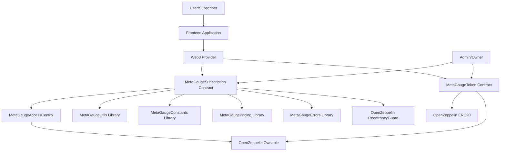
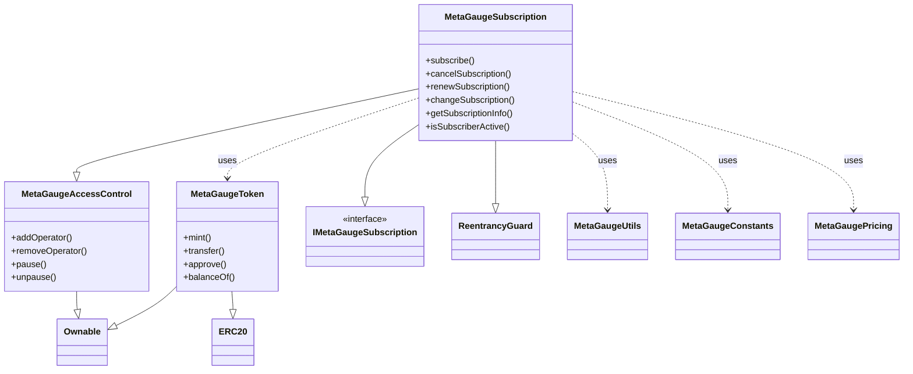
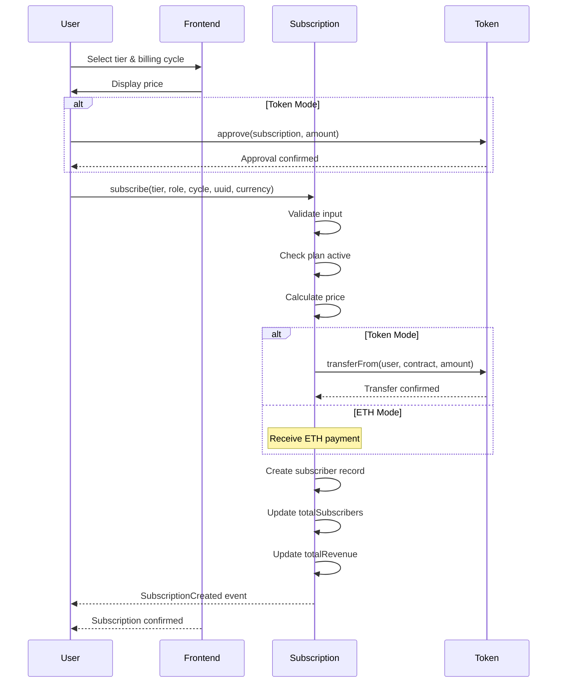
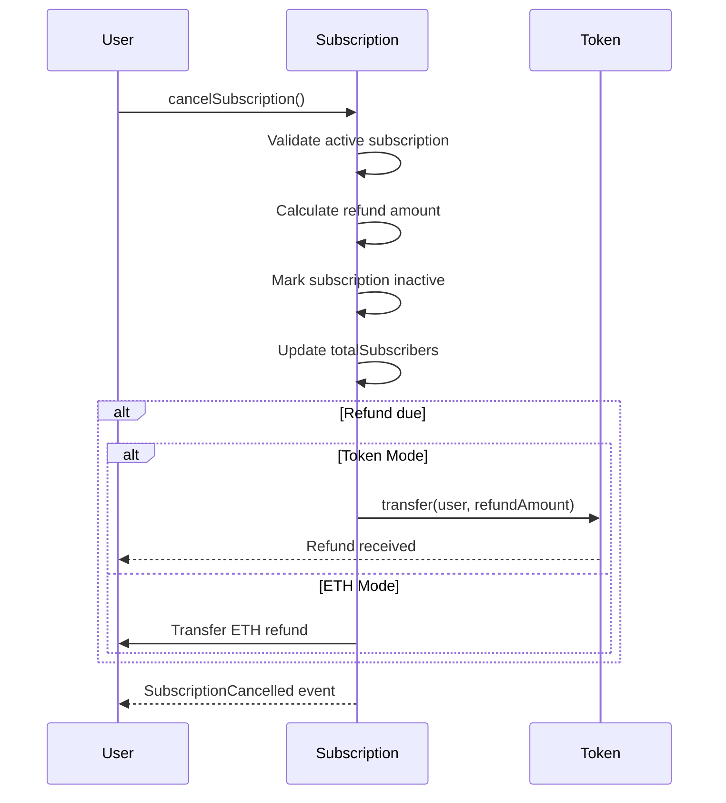
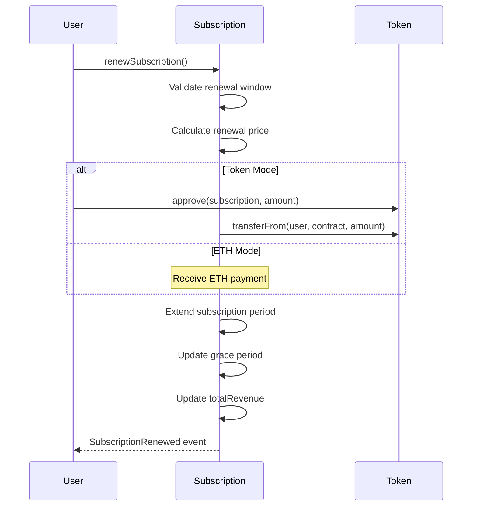
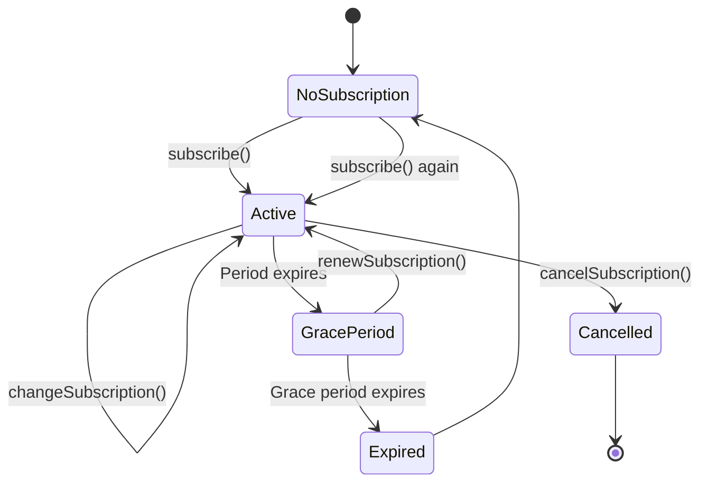

# MetaGauge System Architecture

## Overview

MetaGauge is a decentralized subscription management system built on the Lisk blockchain. It provides a flexible, secure, and transparent way to manage tiered subscriptions with support for both ETH and ERC20 token payments.

## High-Level Architecture



## Core Components

### 1. MetaGaugeSubscription Contract

The main subscription management contract that handles all subscription operations.

**Responsibilities:**
- User subscription creation and management
- Billing cycle handling (monthly/yearly)
- Payment processing (ETH or tokens)
- Subscription tier management
- Cancellation and refund logic
- Renewal processing
- Subscription changes (upgrades/downgrades)

**Key Features:**
- Four subscription tiers (Free, Starter, Pro, Enterprise)
- Flexible billing cycles
- Pro-rata refunds on cancellation
- Grace period for renewals
- Pausable for emergency situations

### 2. MetaGaugeToken Contract

ERC20 token contract for the MetaGauge Token (MGT) used in token payment mode.

**Responsibilities:**
- Token minting (owner only)
- Standard ERC20 operations
- Supply cap enforcement (500M MGT)

**Key Features:**
- Capped supply at 500 million tokens
- Owner-controlled minting
- Standard ERC20 compliance

### 3. MetaGaugeAccessControl Contract

Access control module providing owner and operator role management.

**Responsibilities:**
- Owner management
- Operator role management
- Pause/unpause functionality

**Key Features:**
- Owner-only administrative functions
- Operator roles for delegated permissions
- Emergency pause mechanism

### 4. Supporting Libraries

#### MetaGaugeUtils
Utility functions for address validation and ETH transfers.

#### MetaGaugeConstants
System-wide constants for pricing, time periods, and limits.

#### MetaGaugePricing
Pricing calculation utilities for subscriptions.

#### MetaGaugeErrors
Custom error definitions for gas-efficient error handling.

## Contract Relationships



## Data Flow

### Subscription Creation Flow



### Cancellation Flow



### Renewal Flow



## Deployment Modes

### ETH Mode
- Payments in native ETH
- No token contract required
- Gas-efficient for users
- Direct ETH transfers

### Token Mode
- Payments in MGT tokens
- Requires token approval
- Centralized payment token
- ERC20 standard compliance

## Security Architecture

### Access Control Layers

1. **Owner Level**
   - Contract deployment
   - Plan status updates
   - Fund withdrawals
   - Operator management
   - Pause/unpause

2. **Operator Level**
   - Delegated administrative tasks
   - Can be added/removed by owner

3. **User Level**
   - Subscribe to plans
   - Cancel subscriptions
   - Renew subscriptions
   - Change subscriptions
   - Update user role

### Security Mechanisms

1. **Reentrancy Protection**
   - ReentrancyGuard on all payment functions
   - Prevents reentrancy attacks

2. **Input Validation**
   - Tier and role range checks
   - UUID validation
   - Payment amount verification
   - Currency mode validation

3. **Pausable Operations**
   - Emergency pause functionality
   - Owner-controlled
   - Affects critical functions

4. **Custom Errors**
   - Gas-efficient error handling
   - Clear revert reasons
   - Type-safe error definitions

## State Management

### Subscription State

```solidity
struct Subscriber {
    address userAddress;
    SubscriptionTier tier;
    UserRole role;
    BillingCycle billingCycle;
    uint256 startTime;
    uint256 endTime;
    uint256 periodStart;
    uint256 periodEnd;
    bool isActive;
    bool cancelAtPeriodEnd;
    uint256 gracePeriodEnd;
    uint256 amountPaid;
    PaymentCurrency currency;
}
```

### Plan Configuration

```solidity
struct SubscriptionPlan {
    string name;
    uint256 monthlyPrice;
    uint256 yearlyPrice;
    PlanFeatures features;
    PlanLimits limits;
    bool active;
}
```

## Subscription Lifecycle



## Gas Optimization Strategies

1. **Struct Packing**
   - Efficient storage layout
   - Minimized storage slots

2. **Mapping Usage**
   - O(1) lookups
   - Direct address access

3. **View Functions**
   - No state modifications
   - Free to call off-chain

4. **Custom Errors**
   - More gas-efficient than strings
   - Type-safe error handling

5. **Batch Operations**
   - Potential for future optimization
   - Multiple operations in single transaction

## Scalability Considerations

### Current Design
- Single contract for all subscriptions
- Mapping-based storage
- Linear growth with user count

### Future Enhancements
- Sharding by subscription tier
- Off-chain indexing for queries
- Layer 2 integration
- Batch processing for admin operations

## Integration Points

### Frontend Integration
- Web3 provider connection
- Contract ABI usage
- Event listening
- Transaction signing

### Backend Integration
- Event monitoring
- Subscription status tracking
- Analytics and reporting
- Automated renewals

### External Systems
- Payment gateways (for fiat on-ramps)
- Analytics platforms
- Notification services
- Customer support systems

## Monitoring and Observability

### Events for Monitoring
- `SubscriptionCreated`
- `SubscriptionCancelled`
- `SubscriptionRenewed`
- `SubscriptionChanged`
- `FundsWithdrawn`
- `PlanTierUpdated`

### Key Metrics
- Total subscribers
- Total revenue
- Subscription distribution by tier
- Churn rate
- Renewal rate
- Average subscription value

## Upgrade Strategy

### Current Approach
- Non-upgradeable contracts
- Immutable logic
- Migration required for changes

### Future Considerations
- Proxy pattern implementation
- Storage layout planning
- Upgrade governance
- Migration tools

## Network Architecture

### Lisk Blockchain
- EVM-compatible
- Fast block times
- Low transaction costs
- Reliable infrastructure

### Network Endpoints
- **Mainnet**: https://rpc.api.lisk.com
- **Testnet**: https://rpc.sepolia-api.lisk.com
- **Explorer**: https://blockscout.lisk.com

## Conclusion

The MetaGauge architecture provides a robust, secure, and flexible subscription management system. The modular design allows for easy maintenance and future enhancements while maintaining security and gas efficiency.

For detailed contract specifications, see [Contract Documentation](./contracts.md).
